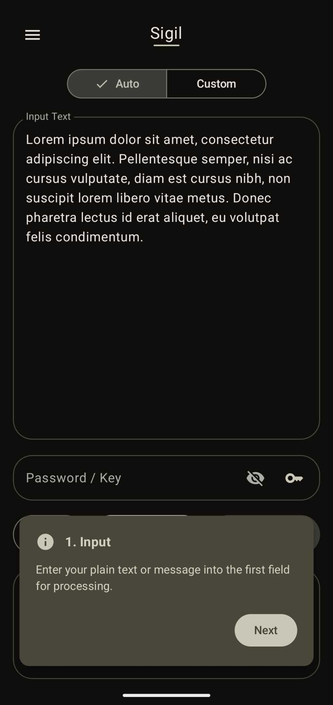
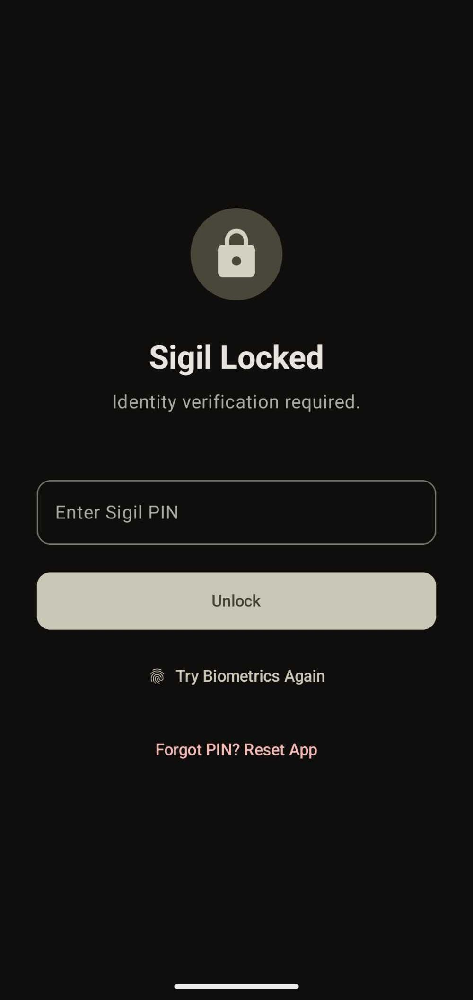
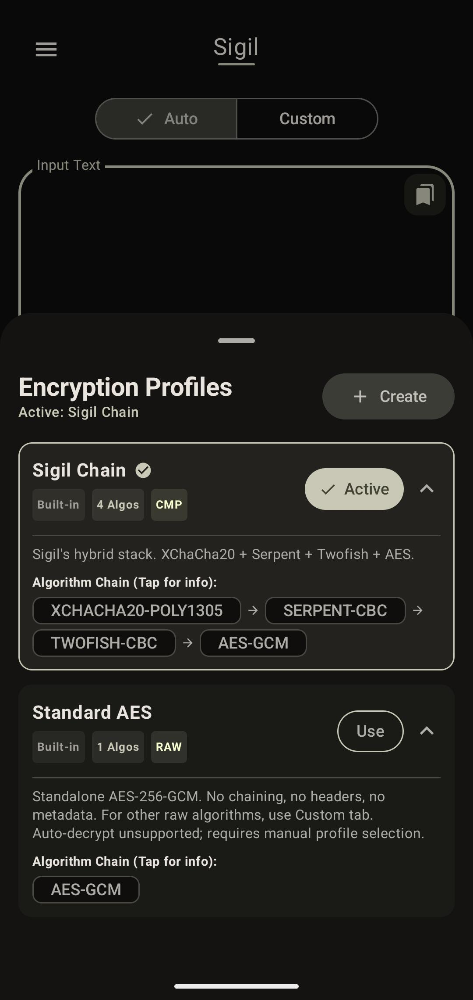
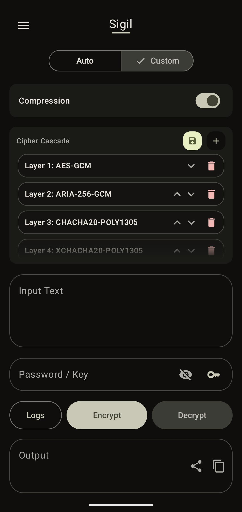
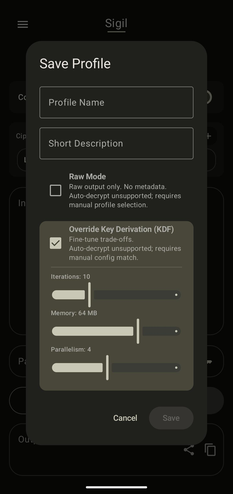
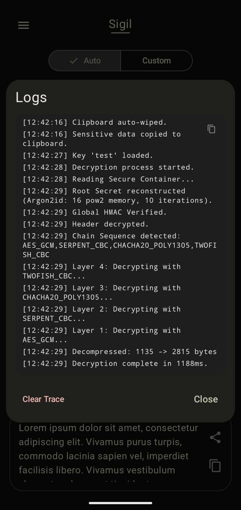
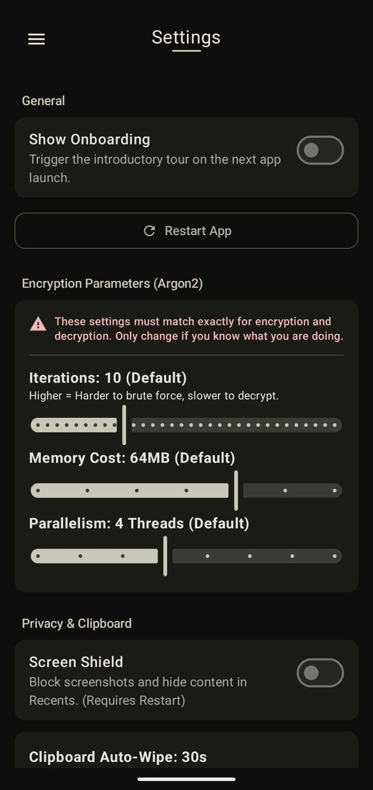
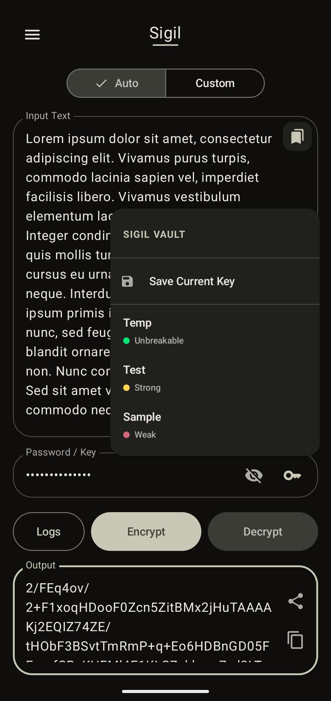
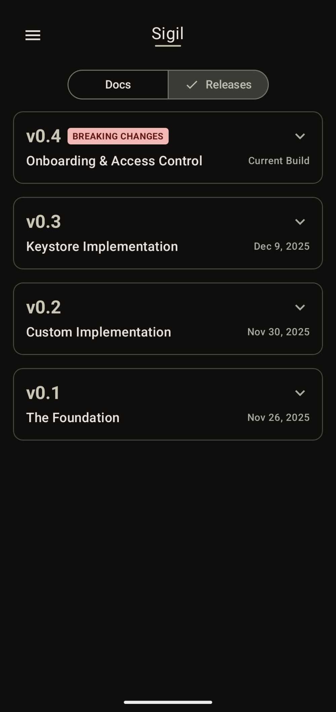

# SIGIL 
**Open-source, offline zero-trust encryption utility**

[](https://github.com/Animesh-Varma/Sigil/releases)
[](https://github.com/Animesh-Varma/Sigil/blob/master/LICENSE)
[](https://github.com/Animesh-Varma/Sigil/actions/workflows/android-build.yml)
[](https://github.com/Animesh-Varma/Sigil/actions/workflows/codeql.yml)
[](https://github.com/Animesh-Varma/Sigil/issues)
[](https://github.com/Animesh-Varma/Sigil/pulls)

[](https://sonarcloud.io/dashboard?id=Animesh-Varma_Sigil)
[](https://sonarcloud.io/dashboard?id=Animesh-Varma_Sigil)
[](https://sonarcloud.io/dashboard?id=Animesh-Varma_Sigil)
[](https://www.codefactor.io/repository/github/Animesh-Varma/Sigil)

Sigil is an encryption utility built with a focus on defense-in-depth and memory safety. In a world where privacy policies change overnight and "end-to-end" often has a backdoor, Sigil provides a secure, offline-only toolset for securing sensitive information.

By default, Sigil uses a Quad-Layer encryption chain that exceeds almost any threat model. But hey, why settle for standard security when you can have more? (There is also a standard "Raw Mode" for those who critique multi-layered encryption). :)

Sigil aims to be much more than just an encryption app; it aims to be a complete security suite to address all your cryptography needs. Check out the [Roadmap](#roadmap) for planned features—any suggestions are highly appreciated!

---

## Downloads

<div align="left">
    <a href="https://apt.izzysoft.de/fdroid/index/apk/dev.animeshvarma.sigil">
        
    </a>
    <a href="https://play.google.com/store/apps/details?id=dev.animeshvarma.sigil">
        
    </a>
      <a href="https://github.com/Animesh-Varma/Sigil/releases/latest">
    
  </a>
</div>

### Release Status

| Platform | Current Version  | Build Channel |
| :--- |:-----------------| :--- |
| **IzzyOnDroid** | **v0.4.5**       | Pre-release |
| **Google Play** | **v0.4.5**       | Pre-release |
| **GitHub Releases** | **v0.4.5**       | Pre-release |

---

<h3 align="center">Contents</h2>

<p align="center">
  <a href="#features">Features</a> •
  <a href="#how-it-works">How It Works</a> •
  <a href="#implemented-modules">Modules</a> •
  <a href="#screenshots">Screenshots</a> •
  <a href="#algorithm-registry">Algorithms</a>
  <br>
  <a href="#roadmap">Roadmap</a> •
  <a href="#technical-stack">Tech Stack</a> •
  <a href="#privacy">Privacy</a> •
  <a href="#build-instructions">Build</a> •
  <a href="#contact">Contact</a>
</p>

---

## Features

- **Encryption Profiles (New):** Switch between "Raw Mode" (Standard encryption compatibility for any algo), the classic "Sigil Chain", or create your own chain!
- **Multi-Layer Cascade:** By default, Sigil encrypts your data with the "Sigil Chain" profile (`XChaCha20` → `Serpent` → `Twofish` → `AES-256`). The number of algorithms doesn't really increase encryption time, as for text encryption, most of the time is taken just by the KDF.
- **Zero-Knowledge Auth:** Support for both **PINs** and **Passwords**. Authentication is handled via salted Argon2id hashes. Credentials are never stored in a reversible format.
- **Hardware-Backed Keystore:** Master seeds are generated and stored inside your phone's **Trusted Execution Environment (TEE)**. They never touch the app layer in plaintext.
- **Access Control:** Includes TEE-verified Biometrics and **Screen Shield** (just fancy talk for `flag_secure`).
- **Memory Hygiene:** Sigil zeros out (wipes) byte arrays from RAM the moment they aren't needed to prevent RAM dumps.
- **Material 3 UI:** Just because it's a security tool doesn't mean it has to look like an app from the 90s. ;)

---

## How It Works

### **Key Derivation (Argon2id)**
Sigil uses Argon2id as the primary KDF. It's memory-hard, which means it forces the device to use a chunk of RAM (up to 256MB) to unlock. This makes it incredibly annoying/expensive for attackers with GPUs to try and brute-force your password.

### **Encryption Profiles & Raw Mode**
Sigil v0.4.5 introduces **Encryption Profiles**, allowing users to define the complexity of their encryption once and reuse it:

1.  **Sigil Chain (Default):** The classic hybrid cascade designed for maximum defense depth. It wraps data in a custom container with metadata headers, compression, and KDF salts.
    *   *Layers:* `XChaCha20-Poly1305` → `Serpent-CBC` → `Twofish-CBC` → `AES-256-GCM`.
2.  **Standard AES:** For users who prefer a minimal attack surface or require compatibility with external tools (e.g., OpenSSL). This mode bypasses the multi-cipher chain and metadata headers, outputting pure ciphertext/IV/tag.
    *   *Flexibility:* You may use **any** algorithm from the registry (AES-GCM, XChaCha20, etc.) in Raw Mode, not just AES, by creating a new profile in Custom Mode and checking the RAW mode box (only available if a single algorithm is selected).
3.  **Custom Profiles:** Define your own cryptographic chain. Select from the registry of 20+ algorithms to create a bespoke encryption pipeline suited to your specific threat model. You can also override global KDF settings per profile if required (even though global settings are tweakable in the settings tab).

---

## Implemented Modules

### **Encryption (Auto & Custom)**
- **Auto Tab:** Quickly encrypt your text using Saved Profiles (Custom Chains) and Built-in ones.
- **Custom Tab:** A layer manager allowing users to select specific algorithms from the registry, reorder the cascade, and toggle ZLib compression among other things. This is also where you save new profiles.

### **Keystore**
- A manager for your saved keys. Sigil only decrypts these from the hardware vault when you successfully authenticate.
- Includes an **Entropy Meter** to show you how strong your key actually is.

### **Settings**
- **Cryptography Tuning:** Tweak the Argon2id parameters (Iterations, Memory, Parallelism).
- **App Lock:** A new wizard to set up your PIN or Password safely.
- **Privacy:** Controls for Screen Security, Grace Periods, and clipboard auto-wipe.
- **Appearance:** Dynamic colors and themes.

---

## Screenshots 
`Todo: update before PR`

<details>
<summary><b>Click here to view App Screenshots</b></summary>
<br>

<div align="center">

|                                                                                                                              |                                                                                                                                        |                                                                                                                              |
|:----------------------------------------------------------------------------------------------------------------------------:|:--------------------------------------------------------------------------------------------------------------------------------------:|:----------------------------------------------------------------------------------------------------------------------------:|
| <br><b>Onboarding</b> |        <br><b>App Lock</b>        | <br><b>Navigation</b> |
|  <br><b>Auto Mode</b>  |     <br><b>Custom Mode</b>     | <br><b>Algorithms</b> |
|      <br><b>Usage</b>      |            <br><b>Logs</b>            |   <br><b>Settings</b>   |
|   <br><b>Keystore</b>   | <br>Secure Vaulting<b></b> |   <br><b>Releases</b>   |

</div>

</details>

---

## Algorithm Registry

Sigil currently supports **20 cryptographic algorithms**, including modern standards, AES finalists, and some legacy ones (for educational/testing purposes).

| Algorithm | Type | Block Size | Origin/Standard | Status |
| :--- | :--- | :--- | :--- | :--- |
| **AES-GCM** | Block (AEAD) | 128-bit | NIST Standard (USA) | **Primary** |
| **ChaCha20-Poly1305** | Stream (AEAD) | N/A | IETF Standard | **Primary** |
| **XChaCha20-Poly1305** | Stream (AEAD) | N/A | Extended Nonce Variant | **SOTA** |
| **ARIA-256-GCM** | Block (AEAD) | 128-bit | IETF RFC 5794 (South Korea) | **Very Strong** |
| **Serpent** | Block (CBC) | 128-bit | AES Finalist | **Strong** |
| **Twofish** | Block (CBC) | 128-bit | AES Finalist | **Strong** |
| **Camellia** | Block (CBC) | 128-bit | NESSIE/CRYPTREC (EU/Japan) | **Strong** |
| **SM4** | Block (CBC) | 128-bit | GB/T 32907 (China) | **Strong** |
| **SEED** | Block (CBC) | 128-bit | KISA (South Korea) | **Strong** |
| **CAST-256** | Block (CBC) | 128-bit | AES Finalist | **Strong** |
| **RC6** | Block (CBC) | 128-bit | AES Finalist | **Strong** |
| **AES-CBC** | Block (CBC) | 128-bit | NIST Standard | Legacy Support |
| **Blowfish** | Block (CBC) | 64-bit | Legacy Schneier Design | *Weak (Flagged)* |
| **IDEA** | Block (CBC) | 64-bit | PGP Standard | *Weak (Flagged)* |
| **CAST-128** | Block (CBC) | 64-bit | GPG Legacy | *Weak (Flagged)* |
| **GOST 28147** | Block (CBC) | 64-bit | GOST (USSR/Russia) | *Weak (Flagged)* |
| **TEA** | Block (CBC) | 64-bit | Cambridge | *Weak (Flagged)* |
| **XTEA** | Block (CBC) | 64-bit | Extended TEA | *Weak (Flagged)* |

---

## Roadmap

Development is active. To view the current status, planned features, and release milestones, please visit the official Project Board.

[**View Project Roadmap**](https://github.com/users/Animesh-Varma/projects/2)

---

## Technical Stack

- **Language:** Kotlin
- **UI:** Jetpack Compose (Material 3 Expressive APIs)
- **Cryptography:** Bouncy Castle (bcprov-jdk18on v1.83)
- **Persistence:** Hardware Keystore (TEE) + Encrypted SharedPreferences
- **Architecture:** MVVM + UDF with Clean Architecture

---

## Privacy

Sigil is strictly **Offline-Only**. 
1. **No Internet:** The `INTERNET` permission is absent from the manifest. Data cannot leave the device.
2. **No Analytics:** No trackers, telemetry, or crash reporters included.
3. **No Backups:** `android:allowBackup` is disabled to prevent encrypted vault data from being synced to cloud providers accidentally.

---

## Build Instructions

Ensure you have the latest Android Studio and JDK 17+.

```bash
git clone https://github.com/Animesh-Varma/Sigil.git
cd Sigil
./gradlew assembleDebug
```

---

## Security Disclaimer

Sigil is an open-learning project. While I try my hardest to adhere to best practices, it hasn't been audited by a professional firm yet. I encourage you to read the code!

**Permanent Data Loss:** If you lose your Master PIN or Password, your data is gone forever. I can't help you recover it. (-_-)

---

## Contact

If you have questions or security findings:
Email: `sigil@animeshvarma.dev`

**Note:** This is my first foray into Android development and cryptography. I’m a high school student building this project in any spare time I can find, so contributors and general advice are always more than welcomed!
