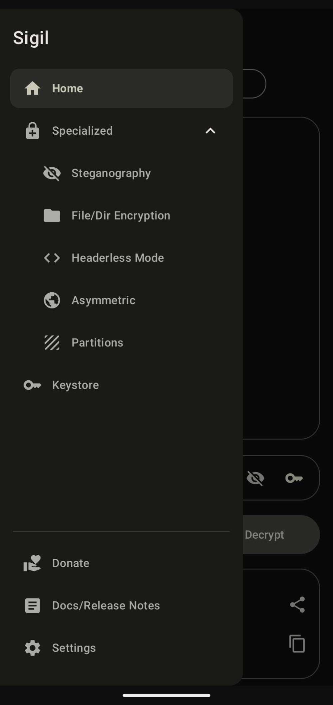
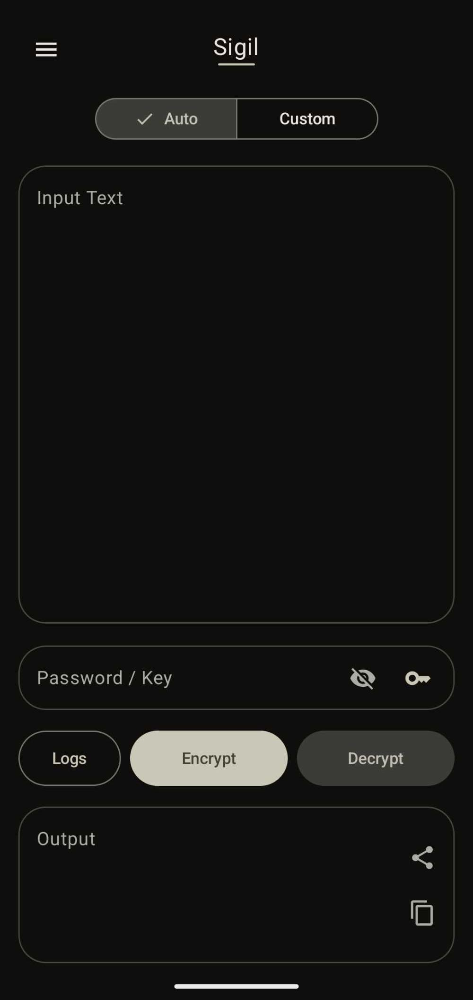
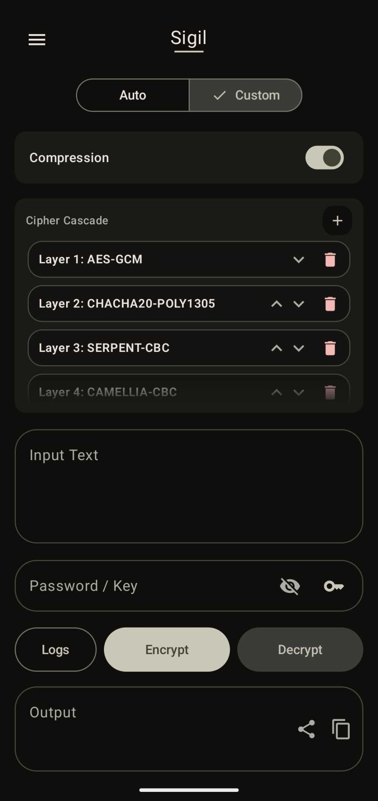
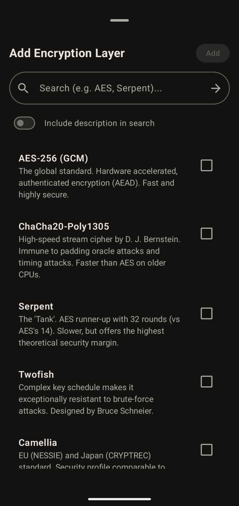
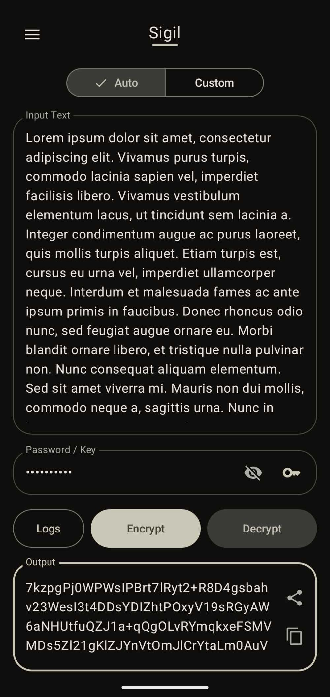
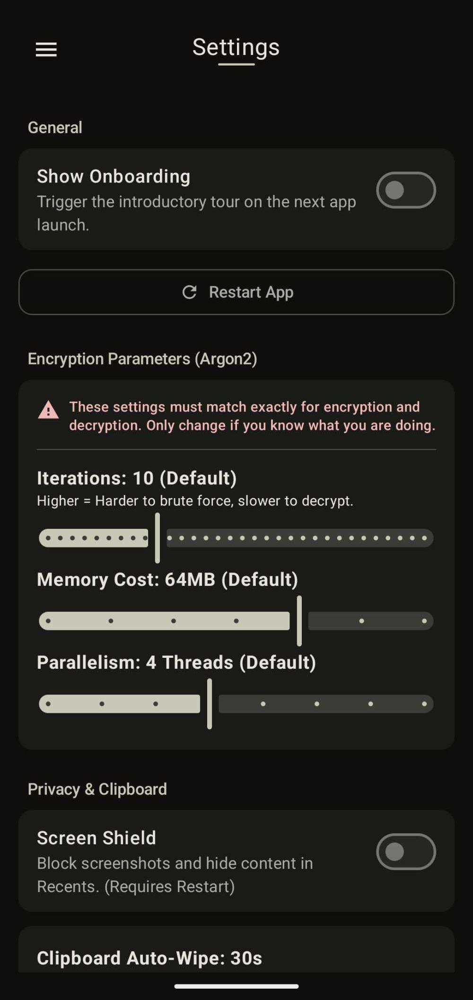
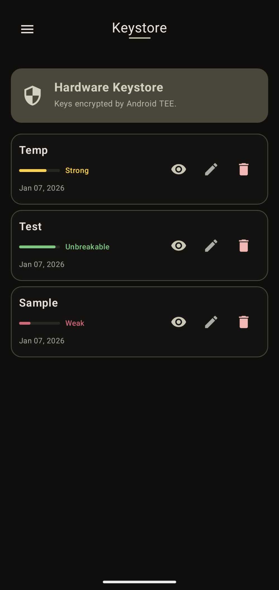
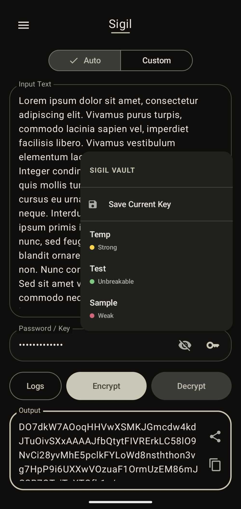

# SIGIL
**Open-source, offline zero-trust encryption utility with multi-layer chaining**

[](https://github.com/Animesh-Varma/Sigil/releases)
[](https://github.com/Animesh-Varma/Sigil/actions/workflows/android-build.yml)
[](https://www.codefactor.io/repository/github/animesh-varma/sigil)
[](https://github.com/Animesh-Varma/Sigil/issues)
[](https://github.com/Animesh-Varma/Sigil/pulls)
[](https://github.com/Animesh-Varma/Sigil/blob/master/LICENSE)

Sigil is an encryption app built to the highest standards. In a world of privacy leaks where you can trust no one, Sigil provides a Zero-Trust, offline-first fortress for your secrets.

With a Quad-Layer encryption chain that exceeds standard government protocols, Sigil ensures your data is mathematically safe. But this is just the start, Sigil aims to be much more than a simple text tool, evolving into a complete privacy ecosystem for Steganography, Plausible Deniability, and absolute data control.

---

## Downloads

<div align="left">
    <a href="https://apt.izzysoft.de/fdroid/index/apk/dev.animeshvarma.sigil">
        
    </a>
    <a href="https://play.google.com/store/apps/details?id=dev.animeshvarma.sigil">
        
    </a>
      <a href="https://github.com/Animesh-Varma/Sigil/releases/latest">
    
  </a>
</div>

### Release Status

| Platform | Current Version | Build Channel |
| :--- | :--- | :--- |
| **IzzyOnDroid** | *Pending* | --- |
| **Google Play** | **v0.4.0** | Pre-release |
| **GitHub Releases** | **v0.4.0** | Pre-release |

---

<h3 align="center">Contents</h2>

<p align="center">
  <a href="#features">Features</a> •
  <a href="#how-it-works">How It Works</a> •
  <a href="#implemented-modules">Modules</a> •
  <a href="#screenshots">Screenshots</a> •
  <a href="#algorithm-registry">Algorithms</a>
  <br>
  <a href="#coming-soon">Coming Soon</a> •
  <a href="#technical-stack">Tech Stack</a> •
  <a href="#privacy">Privacy</a> •
  <a href="#build-instructions">Build</a> •
  <a href="#contact">Contact</a>
</p>

---

## Features

- **Quad-Layer Hybrid Cascade:** Sigil utilizes a chain that buries data beneath `AES-256`, `ChaCha20`, `Twofish`, and `Serpent` by default.
- **Zero-Knowledge PIN Architecture:** Authentication is handled via salted Argon2id hashes. Sigil cannot recover your PIN, and the secret is never stored in a reversible format.
- **Hardware-Anchored Vault:** Sigil integrates directly with the **Android Trusted Execution Environment (TEE)**. Master seeds are generated, wrapped, and stored inside the secure hardware element, ensuring they never touch the application layer in plaintext.
- **Extensive Access Control:** A complete lockdown suite featuring TEE-verified Biometrics, a custom backup PIN, smart grace periods for multitasking, and a system-level **Screen Shield** to block screenshots and visual snooping.
- **Amnesia Protocol:** Strict memory hygiene enforces the zeroing-out of sensitive data buffers the moment an operation completes or the app enters the background.
- **Material 3 Expressive UI:** A polished interface built with Jetpack Compose, featuring spring-based physics and haptic feedback for a tactile experience.

---

## How It Works

### **Key Derivation (Argon2id)**
Sigil employs Argon2id as the primary KDF. Unlike legacy hashing, it is memory-hard. By requiring significant RAM (up to 256MB) during derivation, Sigil ensures that brute-forcing a password becomes computationally expensive for external attackers.

### **The Cascade Logic**
In "Home (Auto) Tab," Sigil implements a randomized hybrid chain using four distinct architectures:
1. **AES-256** (Substitution-Permutation Network)
2. **ChaCha20-Poly1305** (ARX Stream Cipher)
3. **Twofish** (Feistel Network)
4. **Serpent** (Conservative Bitslice Block Cipher)

By combining these, the data remains protected even if a theoretical breakthrough compromises a single cipher architecture. (I am currently contemplating switching the default to just ChaCha or AES to increase speed for normal users and provide a real-time solution; suggestions are appreciated!)

In Home (Custom) tab mode, you can mix-and-match all the Algorithms available in the [Algorithm Registry](#algorithm-registry).

---

## Implemented Modules

### **Home (Auto & Custom Mode)**
- **Auto Mode:** A streamlined interface for the standard 4-layer cascade, designed for quick and easy use. (To be updated with a modular version in a future release).
- **Custom Mode:** A layer manager allowing users to select specific algorithms from the registry, reorder the cascade, and toggle ZLib compression.

### **Keystore (Hardware Vault)**
- A management hub for saved keys. Sigil decrypts vault entries from the TEE only when they are requested (hence the load time) after successful biometric or PIN verification at app start.
- Includes an **Entropy Meter** to estimate the mathematical strength of a chosen key.

### **Settings**
- **Cryptography Tuning:** Granular control over Argon2id parameters (Iterations, Memory, Parallelism).
- **Privacy & Logic:** Management of the "Screen Shield" (screenshot blocking), Grace Period timers, clipboard auto-wipe, and the App Lock configuration.
- **Appearance:** Support for Material You dynamic colors and a custom HSV accent color picker (Requires Material You to be off).

---

## Screenshots

<details>
<summary><b>Click here to view App Screenshots</b></summary>
<br>

<div align="center">

| | | |
|:---:|:---:|:---:|
| <br><b>Onboarding</b> | <br><b>App Lock</b> | <br><b>Navigation</b> |
| <br><b>Auto Mode</b> | <br><b>Custom Mode</b> | <br><b>Algorithms</b> |
| <br><b>Usage</b> | <br><b>Logs</b> | <br><b>Settings</b> |
| <br><b>Keystore</b> | <br>Secure Vaulting<b></b> | <br><b>Releases</b> |

</div>

</details>

---

## Algorithm Registry

Sigil integrates a comprehensive library of **16 cryptographic algorithms**, encompassing modern government standards, high-margin AES finalists, and legacy ciphers for analysis.

| Algorithm | Type | Block Size | Origin/Standard | Status |
| :--- | :--- | :--- | :--- | :--- |
| **AES-GCM** | Block (AEAD) | 128-bit | NIST Standard (USA) | **Primary** |
| **ChaCha20-Poly1305** | Stream (AEAD) | N/A | IETF Standard | **Primary** |
| **Serpent** | Block (CBC) | 128-bit | AES Finalist | **Strong** |
| **Twofish** | Block (CBC) | 128-bit | AES Finalist | **Strong** |
| **Camellia** | Block (CBC) | 128-bit | NESSIE/CRYPTREC (EU/Japan) | **Strong** |
| **SM4** | Block (CBC) | 128-bit | GB/T 32907 (China) | **Strong** |
| **SEED** | Block (CBC) | 128-bit | KISA (South Korea) | **Strong** |
| **CAST-256** | Block (CBC) | 128-bit | AES Finalist | **Strong** |
| **RC6** | Block (CBC) | 128-bit | AES Finalist | **Strong** |
| **AES-CBC** | Block (CBC) | 128-bit | NIST Standard | Legacy Support |
| **Blowfish** | Block (CBC) | 64-bit | Legacy Schneier Design | *Weak (Flagged)* |
| **IDEA** | Block (CBC) | 64-bit | PGP Standard | *Weak (Flagged)* |
| **CAST-128** | Block (CBC) | 64-bit | GPG Legacy | *Weak (Flagged)* |
| **GOST 28147** | Block (CBC) | 64-bit | GOST (USSR/Russia) | *Weak (Flagged)* |
| **TEA** | Block (CBC) | 64-bit | Cambridge | *Weak (Flagged)* |
| **XTEA** | Block (CBC) | 64-bit | Extended TEA | *Weak (Flagged)* |

---

## Coming Soon

Architecture is currently being laid for the v1.0.0 initial release:

| Module | Description |
| :--- | :--- |
| **Steganography** | A specialized tab for Steganography. Will support text, photo, video, audio, and file embedding. |
| **Headerless Mode** | A "Plausible Deniability" implementation that outputs raw ciphertext, stripping all Sigil metadata headers. |
| **File Encryption** | Encrypt files and directories present on your phone. |
| **Asymmetric** | Integration of Elliptic Curve Cryptography (ECC) for secure key exchange. |
| **Partitions** | Hidden vaults where multiple keys unlock different data ("Distress Partitions"). |
| **Docs & Donate** | Expanded technical documentation and support channels. |

---

## Technical Stack

- **Language:** Kotlin
- **UI:** Jetpack Compose (Material 3 Expressive APIs)
- **Cryptography:** Bouncy Castle (bcprov-jdk18on v1.83)
- **Persistence:** Hardware Keystore (TEE) + Encrypted SharedPreferences
- **Architecture:** MVI (Model-View-Intent) + Clean Architecture

---

## Privacy

Sigil is strictly **Offline-Only**. 
1. **No Internet:** The `INTERNET` permission is absent from the manifest. Data cannot leave the device.
2. **No Analytics:** No trackers, telemetry, or crash reporters are included.
3. **No Backups:** `android:allowBackup` is disabled to prevent encrypted vault data from being synced to cloud providers accidentally.

---

## Build Instructions

Ensure you have the latest Android Studio and JDK version.

```bash
git clone https://github.com/Animesh-Varma/Sigil.git
cd Sigil
./gradlew assembleDebug
```

---

## Security Disclaimer

Sigil is provided "as is." I am a student building this project to learn and share my interest in cryptography. While I have done my best to implement strong security practices, this software has not been professionally audited. 

**Permanent Data Loss:** Due to the zero-knowledge architecture, if you lose your Master PIN or Password, your data is irretrievable. Sigil has no backdoors.

---

## Contact

If you have questions or security findings:
Email: `sigil@animeshvarma.dev`

**Note:** This is my first foray into Android development and cryptography. I’m a high school student building this project in any spare time I can find, so contributors and general advice are always more than welcomed!
